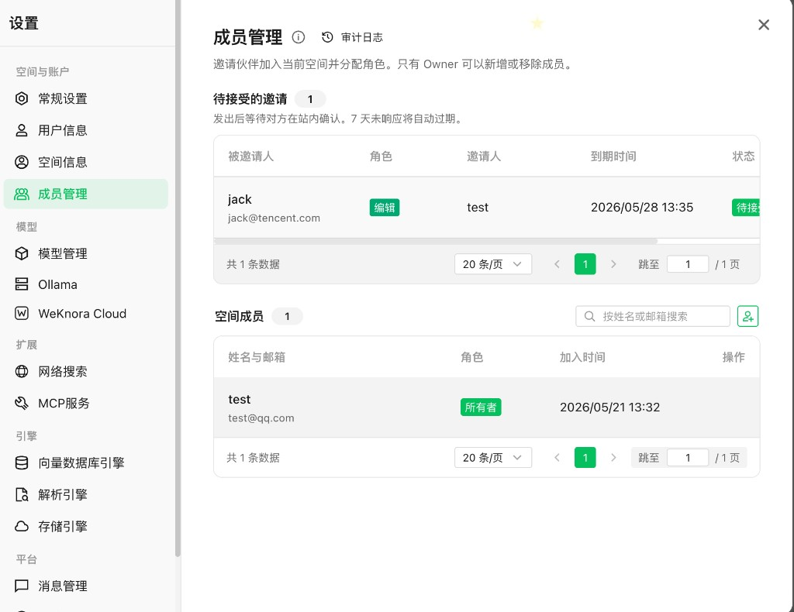
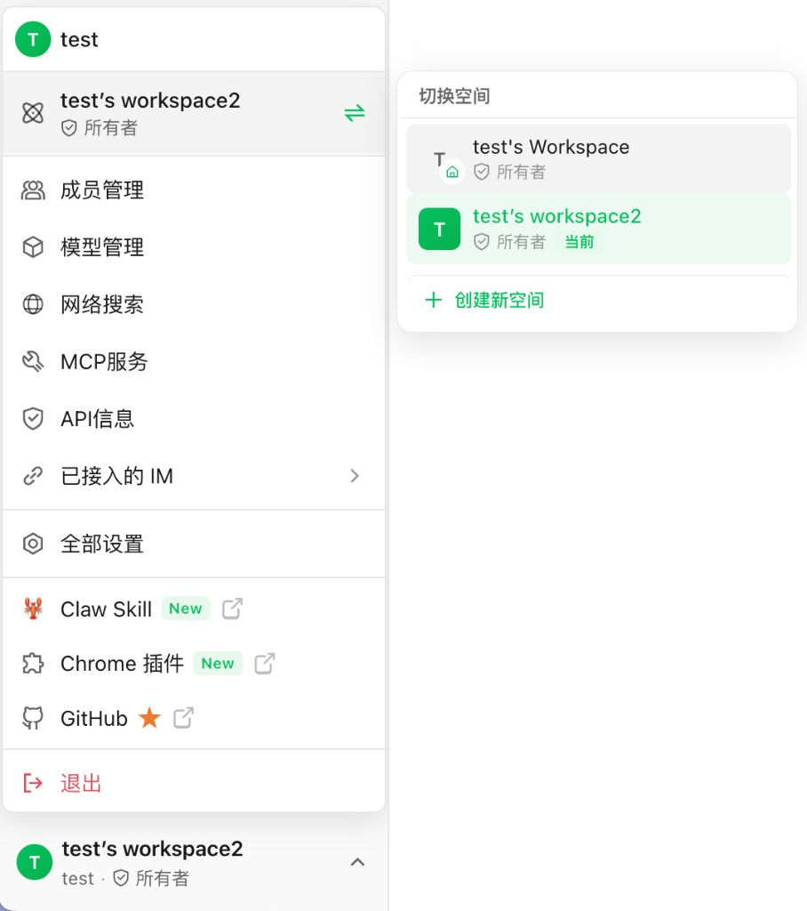
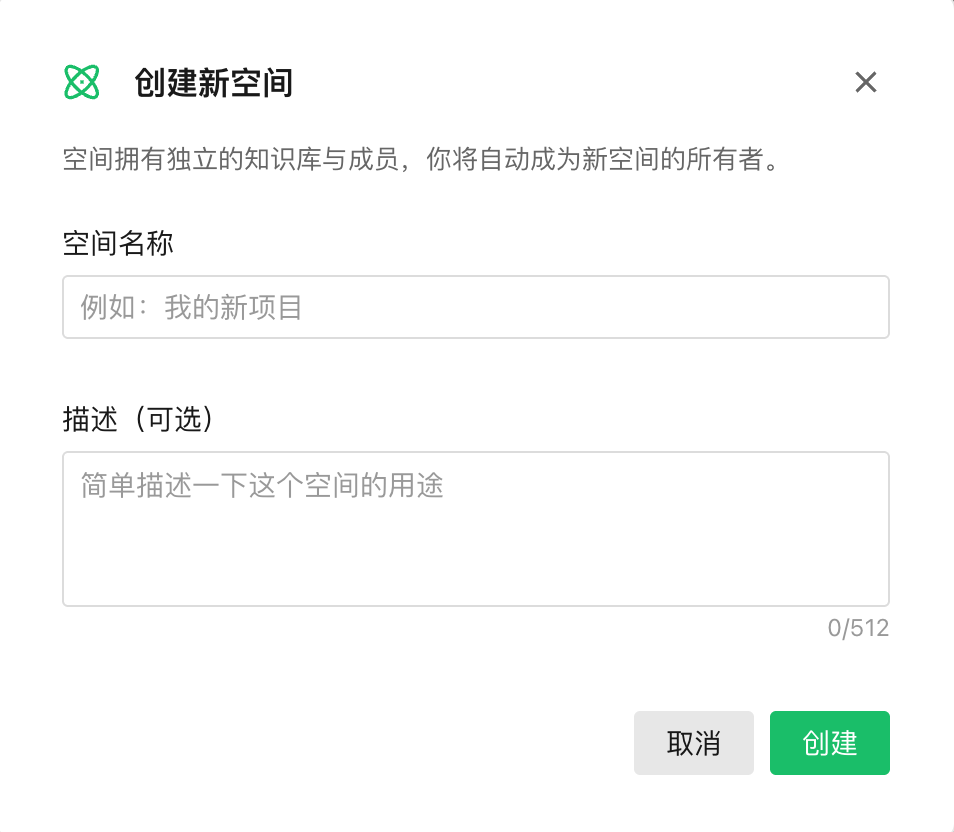
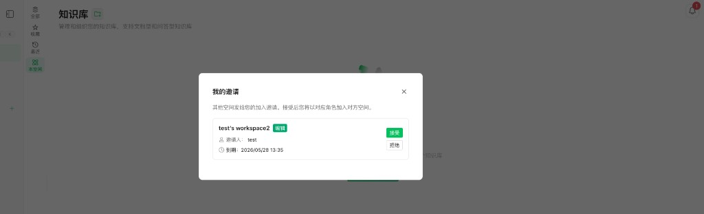

<p align="center">
  <picture>
    
  </picture>
</p>

<p align="center">
  <picture>
    <a href="https://trendshift.io/repositories/15289" target="_blank">
      
    </a>
  </picture>
</p>
<p align="center">
    <a href="https://weknora.weixin.qq.com" target="_blank">
        
    </a>
    <a href="https://chatbot.weixin.qq.com" target="_blank">
        
    </a>
    <a href="https://chromewebstore.google.com/detail/jpemjbopikggjlmikmclgbmkhhopjdgd" target="_blank">
        
    </a>
    <a href="https://clawhub.ai/lyingbug/weknora" target="_blank">
        
    </a>
    <a href="https://github.com/Tencent/WeKnora/blob/main/LICENSE">
        
    </a>
    <a href="./CHANGELOG.md">
        
    </a>
</p>

<p align="center">
| <a href="./README.md"><b>English</b></a> | <a href="./README_CN.md"><b>简体中文</b></a> | <a href="./README_JA.md"><b>日本語</b></a> | <b>한국어</b> |
</p>

<p align="center">
  <h4 align="center">

  [개요](#-개요) • [아키텍처](#️-아키텍처) • [핵심 기능](#-핵심-기능) • [시작하기](#-시작하기) • [API 레퍼런스](#-api-레퍼런스) • [개발자 가이드](#-개발자-가이드)

  </h4>
</p>

# 💡 WeKnora — 문서를 살아있는 지식으로: RAG · Agent 추론 · 자동 Wiki 통합 LLM 지식 프레임워크

## 📌 개요

[**WeKnora**](https://weknora.weixin.qq.com)는 엔터프라이즈급 문서 이해, 시맨틱 검색, 자율 추론 시나리오를 위해 설계된 오픈소스 LLM 기반 지식 프레임워크입니다.

본 프레임워크는 **세 가지 핵심 역량**을 중심으로 구성됩니다. 일상 검색에 최적화된 **RAG 기반 빠른 Q&A**, 지식 검색·MCP 도구·웹 검색을 자율적으로 오케스트레이션하여 복잡한 다단계 작업을 처리하는 **ReAct Agent 추론**, 그리고 Agent가 원본 문서에서 상호 연결된 마크다운 지식베이스와 인터랙티브 지식 그래프를 스스로 생성·유지하는 완전히 새로운 **Wiki 모드**입니다. 다양한 데이터 소스 연동(Feishu / Notion / Yuque, 지속 확장 중), 20개 이상의 LLM 프로바이더 통합, Langfuse 기반 풀스택 관측 가능성, **엔터프라이즈 멀티 테넌트 RBAC(4단계 역할 매트릭스 + 리소스 소유권 + 테넌트 감사 로그)**, 완전 셀프호스팅이 가능한 모듈형 아키텍처를 결합하여, WeKnora는 흩어진 문서를 검색·추론 가능하며 지속적으로 진화하는 전용 지식 자산으로 탈바꿈시킵니다.

Feishu, Notion, Yuque 등 외부 플랫폼에서 지식 자동 동기화를 지원하며(추가 데이터 소스 개발 중), PDF, Word, 이미지, Excel 등 10가지 이상의 문서 포맷을 처리합니다. WeChat Work, Feishu, Slack, Telegram 등의 IM 채널을 통해 Q&A 서비스를 직접 제공할 수 있습니다. 모델 레이어에서 OpenAI, DeepSeek, Qwen(Alibaba Cloud), Zhipu, Hunyuan, Gemini, MiniMax, NVIDIA, Ollama 등 주요 프로바이더를 지원합니다. 전체 프로세스가 모듈화 설계되어 LLM, 벡터 DB, 스토리지 등 구성 요소를 유연하게 교체 가능하며, 로컬 및 프라이빗 클라우드 배포를 지원하여 데이터 완전 자체 관리가 가능합니다. 또한 WeKnora는 **Langfuse**와 원활하게 통합되어 Agent 추론, 토큰 사용량 및 파이프라인에 대한 포괄적인 관측 가능성(Observability)을 제공합니다.

## ✨ 최신 업데이트

**v0.6.0 하이라이트:**

- **테넌트 RBAC(역할 기반 접근 제어)** — 이번 릴리스의 핵심 기능. WeKnora는 이제 모든 변경 라우트에 대해 4단계 테넌트 역할 매트릭스(`Owner` / `Admin` / `Contributor` / `Viewer`)를 강제하며, `chunk → knowledge → kb → creator_id` 체인으로 KB 단위 리소스 소유권을 구현합니다. Contributor는 자신이 만든 리소스에 대해 완전한 권한, 다른 사람의 리소스는 읽기 전용. Admin은 테넌트 전체를 관리, Owner는 추가로 테넌트 삭제 권한을 가집니다. 자세한 내용은 [`docs/RBAC说明.md`](./docs/RBAC说明.md).

  <table>
    <tr>
      <td width="50%" align="center"><b>테넌트 멤버 관리</b><br/></td>
      <td width="50%" align="center"><b>워크스페이스 전환기</b><br/></td>
    </tr>
    <tr>
      <td width="50%" align="center"><b>셀프 서비스 워크스페이스 생성</b><br/></td>
      <td width="50%" align="center"><b>보류 중 초대</b><br/></td>
    </tr>
  </table>

- **테넌트 멤버 관리 및 멀티 워크스페이스 UX**: 멤버 초대 / 삭제 / 역할 변경, `/leave` 엔드포인트, 초대 전용(invite-only) 게이트; 보류 중 초대 다이얼로그 + 글로벌 초대 알림 벨; 사용자 메뉴 내 테넌트 전환기와 역할 인식 UI 가드; 로그인 시 마지막 활성 워크스페이스 자동 복원; 로그인 / 테넌트 전환 시 워크스페이스 컨텍스트가 담긴 풍부한 알림.
- **셀프 서비스 워크스페이스 생성**: 모든 사용자가 자신의 테넌트를 만들 수 있음(환경 변수로 사용자별 상한 제어); 크로스 테넌트 슈퍼 관리자에게는 UI에서 Admin 역할 칩 표시.
- **테넌트별 RBAC 감사 로그**: 모든 RBAC 관련 이벤트를 기록, 일일 리텐션 스윕으로 기본 90일 보관(`created_at` 인덱싱); 크로스 테넌트 슈퍼 관리자 작업은 원본 테넌트에 고정.
- **`weknora` CLI v0.3 / v0.4(GA)**: 프리뷰에서 정식 버전으로 승격, 모든 주요 리소스에 대해 verb-noun 서브트리 커버리지: `agent`(CRUD + invoke / check / status), `chunk`, `session`, `search`(chunks / kb / docs / sessions), `kb`(edit / pin / empty / check / status), `doc`(download / upload --recursive / view / wait), `auth`(refresh / token), `context`, `link / unlink`. 새 `weknora mcp serve`로 큐레이팅된 stdio MCP 서버 제공, Claude Code / Cursor 같은 AI 클라이언트가 WeKnora를 직접 구동 가능. 글로벌 옵션: `--format`, `--json` 필드 선택, `--jq`, `--paginate`, `--all-pages`, `--input`, `--log-level`, `--from-url`, NDJSON 출력, 투명 401 재시도, 시그널 인식 컨텍스트.
- **여러 벡터 저장소에 걸친 KB 검색 팬아웃**: 단일 KB가 여러 벡터 저장소에 바인딩 가능; 검색 엔진이 모든 바인딩된 저장소에 쿼리를 팬아웃하고 결과를 병합. KB 에디터는 create / copy / delete 시 바인딩을 검증해 불일치 상태를 방지.
- **MCP 및 데이터 소스 자격 증명 AES-256-GCM 정적 암호화**: 매끄러운 키 로테이션 지원; API 응답에서 민감 필드 자동 마스킹; 편집 시 자격 증명 손실을 방지하는 새로운 `/credentials` 서브리소스 패턴.
- **Docreader gRPC 하드닝**: app → docreader 연결이 TLS + Token 인증 지원; 기본적으로 docreader gRPC 포트를 호스트에 노출하지 않음; 생성된 proto와 일치시키기 위해 `grpcio` 최소 버전을 1.78.0으로 상향.
- **신규 백엔드 통합**: Zhipu AI 임베더; 화웨이 클라우드 OBS 오브젝트 스토리지; MinerU 문서 파서용 vLLM URL 설정 가능; Apache Doris 호환성 모드 + 모드 전환 가드; docreader URL 화이트리스트(화이트리스트 내 이미지는 재업로드하지 않음).
- **서버 사이드 사용자 환경설정**: 폰트 / 테마 / 메모리 기능 토글을 서버에 영속화; KB 핀 고정을 사용자 단위로(기존 테넌트 전체 공유 모델 대체); KB / Agent 목록에 생성자 이름과 "내가 공유" 라벨 표시.
- **기타 개선**: 사용자 즐겨찾기 + 최근 사용; 멤버용 빠른 탐색 진입점; 사이드바 밀도 리프레시; 테넌트 정보 인라인 편집(description 필드 포함); 지식 문서 태그 선택기 재설계; System Info 페이지에 UI 빌드 버전 표시; Moonshot 모델(`moonshot-v1-*` / `kimi-k2.5` / `k2.6` — 다른 값은 HTTP 400 반환)에 대해 `temperature=1` 강제; MinerU markdown 이미지 구문 과도 이스케이프 수정으로 하류 이미지 추출 정상화; `ErrSessionNotFound` / `ErrKnowledgeBaseNotFound`를 모든 핸들러에서 HTTP 404로 매핑; 세션 액세스를 사용자 단위로 스코프; Go 1.26.0으로 업그레이드.
- **버그 수정**: `Start()` 미호출 시 `audit_log.Stop()` 데드락; 검색 가능한 조직 가입이 초대 코드 만료를 우회하던 문제; 청커가 최상위 헤딩 청크를 병합하던 버그; 무한 스크롤 경쟁으로 문서가 누락되던 문제; 인덱싱 완료된 문서가 즉시 완료되도록; 프론트엔드 오프라인 / 레거시 브라우저 지원; 채팅 히스토리 렌더링 / 페이지네이션 안정성 향상; 기존 모델 테스트 연결 시 저장된 API 키로 폴백.

<details>
<summary><b>이전 릴리스</b></summary>

**v0.5.2 하이라이트:**

- **Wiki 모드 대규모 확장**: Wiki 인제스트가 일반 작업 큐 + 데드레터 큐로 만 건 규모 KB까지 확장; 페이지 링크 그래프에 서브그래프 API + 인터랙티브 탐색 UI 추가.
- **MCP 도구 Human-in-the-Loop 승인**: 민감한 MCP 도구 호출은 Agent를 일시정지시키고 채팅 UI에서 사용자의 명시 승인을 대기.
- **새 LLM / 벡터 DB / 스토리지 / 웹 검색**: Anthropic(Claude), Apache Doris 4.1, Tencent VectorDB, Kingsoft Cloud KS3, SearXNG를 새 백엔드로 추가. Vector Store 관리 UI 및 KB별 인덱싱 전략 토글과 함께 사용 가능.
- **관측 가능성 심화**: Langfuse Span을 retrieval / rerank / agent 단계로 확장; 채팅 스트림 양쪽에서 end-to-end TTFB 기록; LLM 호출 폴백 타임아웃 강화로 worker 풀 영구 차단 방지.
- **적응형 3단계 청킹**: 헤딩 인식 / 휴리스틱 / 재귀 전략으로 자동 라우팅; KB 에디터에 실시간 미리보기 패널 내장. 자세한 내용은 [`docs/CHUNKING.md`](./docs/CHUNKING.md).
- **글로벌 명령 팔레트**: ⌘K 팔레트가 독립 검색 페이지를 대체, 결과에서 바로 새 채팅을 시작 가능.
- **데이터 소스와 모바일**: Yuque 커넥터(전체 + 증분 동기화) 추가, 경량 WeChat 미니프로그램을 `miniprogram/` 에 포함.
- **`weknora` CLI(프리뷰)**: `cli/` 에 공식 명령줄 클라이언트의 초기 버전 포함, 피드백 환영.
- **기타 개선**: 테넌트별 RRF 튜닝; 쿼리 이해 전용 모델; KB 일괄 관리; 사용자 단위 세션 고정과 키워드 검색; 테넌트 전체 IM 채널 개요; 사용자별 저장되는 글꼴 / 테마 설정; 새로운 OpenMaiC 마이크로 클래스룸 Agent 스킬; API 문서 / Swagger / Client SDK 전면 정비.
- **버그 수정**: Embedder가 연결 실패 시 `(nil, nil)` 을 반환해 SIGSEGV를 유발하던 문제 수정; Mimo / DeepSeek 계열 `reasoning_content` 라운드트립 복원; Agent 다중 턴 히스토리를 DB에서 재구성(첨부 replay 포함); OIDC 로그인 수정; Wiki 인제스트 신뢰성 다수 개선; 빈 PDF에서 파일명으로 요약을 환각하지 않도록 수정.

**v0.4.0 하이라이트:**

- **[지식 어시스턴트](https://weknora.weixin.qq.com/platform)**: 클라우드 호스팅 지식 어시스턴트 서비스, 로컬 배포 없이 빠르게 시작 가능
- **WeKnora Cloud**: WeKnora Cloud 프로바이더 통합, LLM 모델 및 문서 파싱 서비스, 자격 증명 관리 및 상태 확인
- **[Chrome 확장 프로그램](https://chromewebstore.google.com/detail/jpemjbopikggjlmikmclgbmkhhopjdgd)**: 브라우저 확장으로 웹페이지 지식 캡처
- **[ClawHub Skill](https://clawhub.ai/lyingbug/weknora)**: ClawHub Skill 마켓플레이스 통합으로 원클릭 스킬 설치
- **WeChat IM 통합**: WeChat 채널 어댑터. QR 코드 로그인 및 롱폴링 메시지 지원
- **첨부파일 처리**: 채팅 파이프라인에서 파일 첨부 지원, 콘텐츠 포맷팅 및 이미지/첨부 메타데이터 주입
- **Azure OpenAI 프로바이더**: Azure OpenAI의 Chat, VLM, Embedding 모델을 완전 지원. 배포 이름 보존 및 dimensions 파라미터 설정 지원
- **Alibaba Cloud OSS 스토리지**: S3 호환 모드를 통한 알리바바 클라우드 OSS 오브젝트 스토리지 지원. 설정 UI, 연결 테스트, 다국어 i18n 제공
- **Notion 커넥터**: Notion 데이터 소스 통합. API 클라이언트, Markdown 렌더러, Connector 인터페이스 구현
- **Baidu & Ollama 웹 검색**: Baidu 및 Ollama를 웹 검색 프로바이더로 추가
- **VectorStore 관리**: 완전한 VectorStore CRUD 기능. 엔티티, 리포지토리, 서비스 레이어, 연결 테스트, API 엔드포인트
- **주요 버그 수정**: Azure OpenAI 엔드포인트 처리, Embedding 잘림, IM 인용 태그 제거, neo4j Go 1.24 Windows 호환성, OSS 서명 문제 수정


**v0.3.6 하이라이트:**

- **ASR(자동 음성 인식)**: ASR 모델 통합으로 오디오 파일 업로드, 문서 내 오디오 미리보기, 음성 전사 기능 지원
- **데이터 소스 자동 동기화(Feishu)**: 완전한 데이터 소스 관리 기능, Feishu Wiki/드라이브 자동 동기화(증분/전체), 동기화 로그 및 테넌트 격리
- **OIDC 인증**: OpenID Connect 로그인 지원, 자동 디스커버리, 커스텀 엔드포인트 설정, 사용자 정보 매핑
- **IM 인용 답장 컨텍스트**: IM 채널에서 인용 메시지를 추출해 LLM 프롬프트에 주입하여 맥락 기반 답변 실현; 비텍스트 인용의 환각 방지 처리
- **IM 스레드 기반 세션**: IM 채널(Slack, Mattermost, Feishu, Telegram)에서 스레드 단위 세션 모드를 지원, 스레드 내 다중 사용자 협업
- **문서 자동 요약**: AI 생성 문서 요약, 최대 입력 크기 설정 가능, 문서 상세 페이지에 전용 요약 섹션
- **Tavily 웹 검색**: Tavily를 새로운 웹 검색 프로바이더로 추가; 웹 검색 프로바이더 아키텍처를 확장성 향상을 위해 리팩토링
- **MCP 자동 재연결**: 서버 연결 끊김 시 MCP 도구 호출 자동 재연결 로직
- **병렬 도구 호출**: Agent 모드에서 errgroup을 사용한 다중 도구 호출 병렬 실행으로 복잡한 작업 처리 속도 향상
- **Agent @멘션 범위 제한**: 사용자 @멘션을 Agent 허용 지식베이스 범위로 제한하여 무단 접근 방지
- **로그인 페이지 성능**: backdrop-filter blur 전체 제거, 애니메이션 요소 축소, GPU 합성 힌트 추가

**v0.3.5 하이라이트:**

- **Telegram, DingTalk & Mattermost IM 통합**: Telegram 봇(webhook/롱폴링, editMessageText 스트리밍), DingTalk 봇(webhook/Stream 모드, AI 카드 스트리밍), Mattermost 어댑터를 신규 추가. IM 채널이 기업WeChat, Feishu, Slack, Telegram, DingTalk, Mattermost 6개 플랫폼으로 확대
- **IM 슬래시 커맨드 및 QA 큐**: 플러그인 방식 슬래시 커맨드 프레임워크(/help, /info, /search, /stop, /clear), 유계 QA 워커 풀, 사용자별 레이트 리밋, Redis 기반 멀티 인스턴스 분산 조정
- **추천 질문**: Agent가 연결된 지식베이스를 기반으로 컨텍스트 맞춤 추천 질문을 자동 생성해 채팅 화면에 표시; 이미지 지식은 질문 생성 작업을 자동 큐 등록
- **VLM을 통한 MCP 도구 이미지 자동 설명**: MCP 도구가 이미지를 반환하면 설정된 VLM 모델로 텍스트 설명을 자동 생성해 텍스트 전용 LLM에서도 이미지 내용 활용 가능
- **Novita AI 프로바이더**: OpenAI 호환 API로 chat, embedding, VLLM 모델 타입을 지원하는 신규 LLM 프로바이더
- **MCP 도구명 안정성**: UUID 대신 service.Name 기반 도구명(재연결 후에도 안정), 고유명 제약 및 충돌 방지 추가; 프론트엔드에서 snake_case를 사람이 읽기 쉬운 형태로 변환
- **채널 추적**: 지식 항목과 메시지에 channel 필드 추가(web/api/im/browser_extension)로 출처 추적 가능
- **주요 버그 수정**: 지식베이스 미설정 시 Agent 빈 응답, 한국어/이모지 문서 요약의 UTF-8 잘림, 테넌트 설정 업데이트 시 API 키 암호화 손실, vLLM 스트리밍 추론 콘텐츠 누락, Rerank 빈 패시지 오류 수정


**v0.3.4 하이라이트:**

- **IM 봇 통합**: 기업WeChat, Feishu, Slack IM 채널 지원, WebSocket/Webhook 모드, 스트리밍 및 지식베이스 통합
- **멀티모달 이미지 지원**: 이미지 업로드 및 멀티모달 이미지 처리, 세션 관리 강화
- **수동 지식 다운로드**: 수동 지식 콘텐츠를 파일로 다운로드, 파일명 정리 및 포맷 처리
- **NVIDIA 모델 API**: NVIDIA 채팅 모델 API 지원, 커스텀 엔드포인트 및 VLM 모델 설정
- **Weaviate 벡터 데이터베이스**: 지식 검색을 위한 Weaviate 벡터 데이터베이스 백엔드 추가
- **AWS S3 스토리지**: AWS S3 스토리지 어댑터 통합, 설정 UI 및 데이터베이스 마이그레이션
- **AES-256-GCM 암호화**: API 키를 AES-256-GCM으로 정적 암호화하여 보안 강화
- **내장 MCP 서비스**: 내장 MCP 서비스 지원으로 Agent 기능 확장
- **하이브리드 검색 최적화**: 타겟 그룹화 및 쿼리 임베딩 재사용으로 검색 성능 향상
- **Final Answer 도구**: 새로운 final_answer 도구 및 Agent 소요 시간 추적으로 워크플로우 개선

**v0.3.3 하이라이트:**

- **부모-자식 청킹**: 계층적 부모-자식 청킹 전략으로 컨텍스트 관리 및 검색 정확도 강화
- **지식베이스 고정**: 자주 사용하는 지식베이스를 고정하여 빠른 접근 지원
- **폴백 응답**: 관련 결과가 없을 때 폴백 응답 처리 및 UI 표시기
- **Rerank 패시지 클리닝**: Rerank 모델의 패시지 클리닝 기능으로 관련성 점수 정확도 향상
- **버킷 자동 생성**: 스토리지 엔진 연결 확인 강화, 버킷 자동 생성 지원
- **Milvus 벡터 데이터베이스**: 지식 검색을 위한 Milvus 벡터 데이터베이스 백엔드 추가

**v0.3.2 하이라이트:**

- 🔍 **지식 검색**: 시맨틱 검색을 지원하는 새로운 "지식 검색" 진입점, 검색 결과를 대화 창으로 바로 가져오기 지원
- ⚙️ **파서 및 스토리지 엔진 설정**: 설정에서 소스별 문서 파서 엔진과 스토리지 엔진 구성 가능, 지식베이스에서 파일 타입별 파서 선택 지원
- 🖼️ **로컬 스토리지 이미지 렌더링**: 로컬 스토리지 모드에서 대화 중 이미지 렌더링 지원, 스트리밍 이미지 플레이스홀더 최적화
- 📄 **문서 미리보기**: 사용자가 업로드한 원본 파일을 미리 볼 수 있는 내장 문서 미리보기 컴포넌트
- 🎨 **UI 최적화**: 지식베이스, 에이전트, 공유 공간 목록 페이지 인터랙션 개편
- 🗄️ **Milvus 지원**: 지식 검색을 위한 Milvus 벡터 데이터베이스 백엔드 추가
- 🌋 **Volcengine TOS**: Volcengine TOS 오브젝트 스토리지 지원 추가
- 📊 **Mermaid 렌더링**: 채팅에서 Mermaid 다이어그램 렌더링 지원, 전체 화면 뷰어/줌/내비게이션/내보내기 기능 포함
- 💬 **대화 일괄 관리**: 일괄 관리 및 전체 세션 삭제 기능
- 🔗 **원격 URL 지식**: 원격 파일 URL로 지식 항목 생성 지원
- 🧠 **메모리 그래프 미리보기**: 사용자 레벨 메모리 그래프 시각화 미리보기
- 🔄 **비동기 재파싱**: 기존 지식 문서를 비동기로 재처리하는 API

**v0.3.0 하이라이트:**

- 🏢 **공유 공간**: 멤버 초대, 멤버 간 지식베이스/에이전트 공유, 테넌트 격리 검색을 지원하는 공유 공간
- 🧩 **Agent Skills**: 스마트 추론 에이전트를 위한 사전 로드 스킬과 샌드박스 기반 보안 격리 실행 환경 제공
- 🤖 **커스텀 에이전트**: 지식베이스 선택 모드(전체/지정/비활성화)와 함께 커스텀 에이전트 생성, 설정, 선택 지원
- 📊 **데이터 분석 에이전트**: 내장 데이터 분석 에이전트, CSV/Excel 분석용 DataSchema 도구
- 🧠 **사고 모드**: LLM과 에이전트의 사고 모드 지원 및 사고 내용 지능형 필터링
- 🔍 **웹 검색 제공자**: DuckDuckGo 외에 Bing, Google 검색 제공자 추가
- 📋 **FAQ 강화**: 일괄 임포트 드라이런, 유사 질문, 검색 결과 매칭 질문 필드, 대량 임포트 오브젝트 스토리지 오프로드
- 🔑 **API Key 인증**: API Key 인증 메커니즘, Swagger 문서 보안 설정
- 📎 **입력창 내 선택**: 입력창에서 지식베이스와 파일을 직접 선택, @멘션 표시
- ☸️ **Helm Chart**: Neo4j GraphRAG 지원을 포함한 Kubernetes 배포용 완전한 Helm Chart 제공
- 🌍 **국제화**: 한국어(한국어) 지원 추가
- 🔒 **보안 강화**: SSRF 안전 HTTP 클라이언트, 향상된 SQL 검증, MCP stdio 전송 보안, 샌드박스 기반 실행
- ⚡ **인프라**: Qdrant 벡터 데이터베이스 지원, Redis ACL, 로그 레벨 설정, Ollama 임베딩 최적화, `DISABLE_REGISTRATION` 제어

**v0.2.0 하이라이트:**

- 🤖 **Agent 모드**: 내장 도구, MCP 도구, 웹 검색을 호출할 수 있는 새로운 ReACT Agent 모드 추가. 다중 반복 및 리플렉션을 통해 종합 요약 리포트 제공
- 📚 **다중 지식베이스 타입**: FAQ/문서 지식베이스 타입 지원 및 폴더 임포트, URL 임포트, 태그 관리, 온라인 입력 기능 추가
- ⚙️ **대화 전략**: Agent 모델, 일반 모드 모델, 검색 임계값, 프롬프트 설정 지원. 멀티턴 대화 동작을 정밀 제어
- 🌐 **웹 검색**: 확장 가능한 웹 검색 엔진 지원, DuckDuckGo 검색 엔진 내장
- 🔌 **MCP 도구 통합**: MCP를 통한 Agent 기능 확장 지원, uvx/npx 런처 내장, 다양한 전송 방식 지원
- 🎨 **새 UI**: Agent/일반 모드 전환, 도구 호출 과정 표시, 지식베이스 관리 인터페이스 전면 개선
- ⚡ **인프라 업그레이드**: MQ 비동기 작업 관리 도입, 자동 DB 마이그레이션 및 고속 개발 모드 지원

</details>


## 📱 기능 데모

<table>
  <tr>
    <td colspan="2" align="center"><b>💬 지능형 Q&A 대화</b><br/></td>
  </tr>
  <tr>
    <td width="50%" align="center"><b>📖 Wiki 브라우저</b><br/></td>
    <td width="50%" align="center"><b>🕸️ Wiki 지식 그래프</b><br/></td>
  </tr>
  <tr>
    <td width="50%" align="center"><b>🤖 Agent 모드 · 도구 호출 과정</b><br/></td>
    <td width="50%" align="center"><b>⚙️ 대화 설정</b><br/></td>
  </tr>
  <tr>
    <td colspan="2" align="center"><b>🔭 관측 가능성 · Langfuse Tracing</b><br/></td>
  </tr>
</table>

## 🏗️ 아키텍처


문서 파싱, 벡터화, 검색부터 LLM 추론까지 전체 파이프라인을 모듈화하여 각 구성 요소를 유연하게 교체·확장 가능합니다. 로컬 / 프라이빗 클라우드 배포를 지원하며, 데이터 완전 자체 관리와 진입 장벽 없는 Web UI로 빠르게 시작할 수 있습니다.

## 📊 적용 시나리오

| 시나리오 | 적용 사례 | 핵심 가치 |
|---------|----------|----------|
| **기업 지식 관리** | 내부 문서 검색, 규정 Q&A, 운영 매뉴얼 조회 | 지식 탐색 효율 향상, 교육 비용 절감 |
| **학술 연구 분석** | 논문 검색, 연구 리포트 분석, 학술 자료 정리 | 문헌 조사 가속, 연구 의사결정 지원 |
| **제품 기술 지원** | 제품 매뉴얼 Q&A, 기술 문서 검색, 트러블슈팅 | 고객 지원 품질 향상, 지원 부담 감소 |
| **법무/컴플라이언스 검토** | 계약 조항 검색, 규제 정책 조회, 사례 분석 | 컴플라이언스 효율 향상, 법적 리스크 감소 |
| **의료 지식 지원** | 의학 문헌 검색, 진료 가이드라인 조회, 증례 분석 | 임상 의사결정 지원, 진단 품질 향상 |

## 🧩 기능 개요

**지능형 대화**

| 기능 | 상세 |
|------|------|
| 지능형 추론 | ReACT 점진적 멀티스텝 추론, 지식 검색·MCP 도구·웹 검색을 자율 오케스트레이션, 커스텀 에이전트 지원 |
| 빠른 Q&A | 지식베이스 기반 RAG Q&A, 빠르고 정확한 답변 |
| Wiki 모드 | Agent가 주도하여 원본 문서에서 구조화된 마크다운 Wiki 페이지를 자동 생성 및 유지 관리 |
| 도구 호출 | 내장 도구, MCP 도구, 웹 검색 |
| 대화 전략 | 온라인 프롬프트 편집, 검색 임계값 조정, 멀티턴 문맥 인식 |
| 추천 질문 | 지식베이스 콘텐츠 기반 질문 자동 생성 |

**지식 관리**

| 기능 | 상세 |
|------|------|
| 지식베이스 타입 | FAQ / 문서 / Wiki, 폴더 임포트·URL 임포트·태그 관리·온라인 입력 |
| 데이터 소스 임포트 | Feishu / Notion / Yuque 지식베이스 자동 동기화(추가 데이터 소스 개발 중), 증분·전체 동기화 지원 |
| 문서 포맷 | PDF / Word / Txt / Markdown / HTML / 이미지 / CSV / Excel / PPT / JSON |
| 검색 전략 | BM25 희소 / Dense 밀집 / GraphRAG 그래프 강화 / 부모-자식 청킹 / 다차원 인덱싱 |
| E2E 테스트 | 전체 파이프라인 시각화, 리콜 적중률·BLEU / ROUGE 지표 평가 |

**연동 및 확장**

| 기능 | 상세 |
|------|------|
| LLM | OpenAI / Azure OpenAI / Anthropic (Claude) / DeepSeek / Qwen (Alibaba Cloud) / Zhipu / Hunyuan / Doubao (Volcengine) / Gemini / MiniMax / NVIDIA / Novita AI / SiliconFlow / OpenRouter / Ollama |
| Embedding | Ollama / BGE / GTE / OpenAI 호환 API |
| 벡터 DB | PostgreSQL (pgvector) / Elasticsearch / Milvus / Weaviate / Qdrant / Apache Doris / Tencent VectorDB |
| 오브젝트 스토리지 | 로컬 / MinIO / AWS S3 / Volcengine TOS / Alibaba Cloud OSS / Kingsoft Cloud KS3 |
| IM 통합 | WeChat Work / Feishu / Slack / Telegram / DingTalk / Mattermost / WeChat |
| 웹 검색 | DuckDuckGo / Bing / Google / Tavily / Baidu / Ollama / SearXNG |

**플랫폼**

| 기능 | 상세 |
|------|------|
| 배포 | 로컬 / Docker / Kubernetes (Helm), 프라이빗/오프라인 배포 지원 |
| UI | Web UI / RESTful API / CLI (`weknora`) / Chrome Extension / WeChat 미니 프로그램 |
| 관측 가능성 | ReAct 루프, 토큰 소비, 도구 호출, 파이프라인 추적을 위한 Langfuse 통합 |
| 작업 관리 | MQ 비동기 작업, 버전 업그레이드 시 자동 DB 마이그레이션 |
| 모델 관리 | 중앙 설정, 지식베이스별 모델 선택, 멀티테넌트 내장 모델 공유, WeKnora Cloud 호스팅 모델 및 문서 파싱 |

## 🧩 Chrome 확장 프로그램

[**WeKnora Chrome 확장 프로그램**](https://chromewebstore.google.com/detail/jpemjbopikggjlmikmclgbmkhhopjdgd)을 사용하면 브라우저에서 웹 콘텐츠를 WeKnora 지식베이스에 직접 캡처할 수 있습니다. 텍스트, 이미지 또는 전체 페이지를 선택하고 원클릭으로 지식 항목으로 저장 — 복사/붙여넣기나 파일 업로드 불필요.


## 🦞 ClawHub Skill

[**WeKnora ClawHub Skill**](https://clawhub.ai/lyingbug/weknora)은 ClawHub 플랫폼에 게시된 WeKnora 스킬입니다. 설치 후 WeKnora REST API를 통해 문서 업로드(파일 / URL / Markdown), 하이브리드 검색(벡터 + 키워드), 지식 항목 관리가 가능합니다.

- **문서 임포트** — 에이전트를 통한 파일 업로드, 웹페이지 임포트, Markdown 지식 작성
- **하이브리드 검색** — 단일 또는 다중 지식베이스에서 벡터 + 키워드 통합 검색
- **지식 관리** — 프로그래밍 방식으로 지식 항목 조회, 편집, 삭제


## 🚀 시작하기

### 🛠 사전 준비

- [Docker](https://www.docker.com/) & [Docker Compose](https://docs.docker.com/compose/)
- [Git](https://git-scm.com/)

### 📦 설치 및 실행

```bash
git clone https://github.com/Tencent/WeKnora.git
cd WeKnora
cp .env.example .env   # 필요에 따라 .env 편집 (파일 내 주석 참고)
docker compose up -d   # 코어 서비스 시작
```

시작 후 **http://localhost** 에 접속하여 바로 사용 가능합니다.

> 로컬 Ollama 모델을 사용하려면 먼저 `ollama serve > /dev/null 2>&1 &` 를 실행하세요.

### 🔧 선택 서비스 (Docker Compose Profile)

`--profile` 플래그로 추가 컴포넌트를 활성화합니다. 여러 profile 조합 가능:

| Profile | 설명 | 명령어 |
|---------|------|--------|
| _(기본)_ | 코어 서비스 | `docker compose up -d` |
| `full` | 전체 기능 | `docker compose --profile full up -d` |
| `neo4j` | 지식 그래프 (Neo4j) | `docker compose --profile neo4j up -d` |
| `minio` | 오브젝트 스토리지 (MinIO) | `docker compose --profile minio up -d` |
| `langfuse` | 트레이싱 (Langfuse) | `docker compose --profile langfuse up -d` |

조합 예시: `docker compose --profile neo4j --profile minio up -d`

서비스 중지: `docker compose down`

### 🌐 서비스 주소

| 서비스 | URL |
|--------|-----|
| Web UI | `http://localhost` |
| 백엔드 API | `http://localhost:8080` |
| Langfuse 트레이싱 | `http://localhost:3000` |

## 문서 지식 그래프

WeKnora는 문서를 지식 그래프로 변환해 문서 내 서로 다른 섹션 간 관계를 시각화할 수 있습니다. 지식 그래프 기능을 활성화하면 문서 내부의 시맨틱 연관 네트워크를 분석/구성하여 문서 이해를 돕고, 인덱싱과 검색에 구조화된 지원을 제공해 검색 결과의 관련성과 폭을 향상시킵니다.

자세한 설정은 [지식 그래프 설정 가이드](./docs/KnowledgeGraph.md)를 참고하세요.

## MCP 서버

필요한 설정은 [MCP 설정 가이드](./mcp-server/MCP_CONFIG.md)를 참고하세요.

## 🔌 WeChat 대화 오픈 플랫폼 사용

WeKnora는 [WeChat 대화 오픈 플랫폼](https://chatbot.weixin.qq.com)의 핵심 기술 프레임워크로 사용되며, 보다 간편한 사용 방식을 제공합니다:

- **노코드 배포**: 지식을 업로드하기만 하면 WeChat 생태계에서 지능형 Q&A 서비스를 빠르게 배포하여 "질문 즉시 응답" 경험을 구현
- **효율적인 질문 관리**: 고빈도 질문의 분류 관리 지원, 풍부한 데이터 도구를 통해 정확하고 신뢰할 수 있으며 유지보수하기 쉬운 답변 제공
- **WeChat 생태계 통합**: WeChat 공식계정, 미니프로그램 등 다양한 시나리오에 WeKnora의 Q&A 역량을 자연스럽게 통합


## 📘 API 레퍼런스

문제 해결 FAQ: [문제 해결 FAQ](./docs/QA.md)

상세 API 문서: [API Docs](./docs/api/README.md)

제품 계획 및 예정 기능: [Roadmap](./docs/ROADMAP.md)

## 🧭 개발자 가이드

### ⚡ 고속 개발 모드(권장)

코드를 자주 수정해야 한다면 **매번 Docker 이미지를 다시 빌드할 필요가 없습니다**. 고속 개발 모드를 사용하세요.

```bash
# 인프라 시작
make dev-start

# 백엔드 시작 (새 터미널)
make dev-app

# 프론트엔드 시작 (새 터미널)
make dev-frontend
```

**개발 장점:**
- ✅ 프론트엔드 변경 자동 핫리로드(재시작 불필요)
- ✅ 백엔드 변경 빠른 재시작(5~10초, Air 핫리로드 지원)
- ✅ Docker 이미지 재빌드 불필요
- ✅ IDE 브레이크포인트 디버깅 지원

**상세 문서:** [개발 환경 빠른 시작](./docs/开发指南.md)

### 📁 디렉터리 구조

```
WeKnora/
├── client/      # go client
├── cmd/         # Main entry point
├── config/      # Configuration files
├── docker/      # docker images files
├── docreader/   # Document parsing app
├── docs/        # Project documentation
├── frontend/    # Frontend app
├── internal/    # Core business logic
├── mcp-server/  # MCP server
├── migrations/  # DB migration scripts
└── scripts/     # Shell scripts
```

## 🤝 기여하기

[Issue](https://github.com/Tencent/WeKnora/issues) 또는 Pull Request를 환영합니다.

**절차:** Fork → 브랜치 생성 → 변경사항 커밋 → PR 생성

**규칙:** `gofmt`로 코드 포맷팅, [Conventional Commits](https://www.conventionalcommits.org/) 준수 (`feat:` / `fix:` / `docs:` / `test:` / `refactor:`)

## 🔒 보안 공지

**중요:** v0.1.3부터 WeKnora는 시스템 보안 강화를 위해 로그인 인증 기능을 포함합니다. 운영 환경 배포 시 아래 사항을 강력히 권장합니다.

- WeKnora 서비스를 공용 인터넷이 아닌 내부/사설 네트워크 환경에 배포
- 잠재적 정보 유출 방지를 위해 서비스를 공용 네트워크에 직접 노출하지 않기
- 배포 환경에 적절한 방화벽 규칙 및 접근 제어 구성
- 보안 패치와 개선 사항 적용을 위해 최신 버전으로 정기 업데이트

## 👥 기여자

멋진 기여자 여러분께 감사드립니다:

[](https://github.com/Tencent/WeKnora/graphs/contributors)

## 📄 라이선스

이 프로젝트는 [MIT License](./LICENSE)로 배포됩니다.
적절한 저작권 고지를 유지하는 조건으로 코드를 자유롭게 사용, 수정, 배포할 수 있습니다.

## 📈 프로젝트 통계

<a href="https://www.star-history.com/#Tencent/WeKnora&type=date&legend=top-left">
 <picture>
   <source media="(prefers-color-scheme: dark)" srcset="https://api.star-history.com/svg?repos=Tencent/WeKnora&type=date&theme=dark&legend=top-left" />
   <source media="(prefers-color-scheme: light)" srcset="https://api.star-history.com/svg?repos=Tencent/WeKnora&type=date&legend=top-left" />
   
 </picture>
</a>
